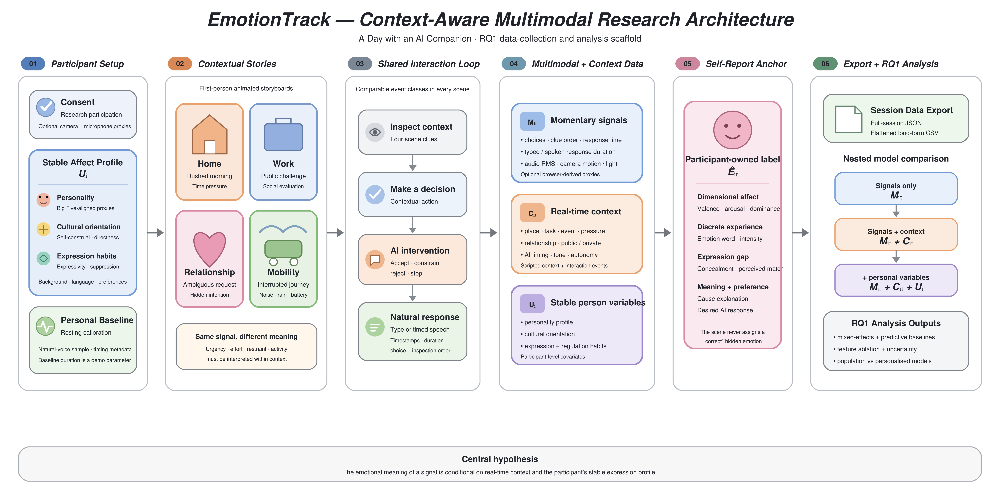

<div align="center">

# A Day with an AI Companion
<div style="color:#9ca3af;font-family:'SimSun','宋体',serif;font-size:20px"></div>

</div>

A browser-based, first-person interactive narrative demo for researching **multimodal perception and context-aware emotion understanding**. The prototype places one participant in four everyday contexts—home, work, close relationships, and outdoor mobility—while preserving a common interaction structure: inspect context, make a decision, respond to an AI intervention, answer in one’s own words, and self-report the affective experience.

<div style="color:#9ca3af;font-family:'SimSun','宋体',serif;font-size:13px">一个基于浏览器、第一人称的交互式叙事演示，用于研究多模态感知与情境感知的情绪理解。原型将一名参与者置于四种日常情境——家庭、工作、亲密关系与户外出行——同时保持一致的交互结构：查看情境、做出决定、回应 AI 干预、用自己的话作答，并自我报告情绪体验。</div>
<br>
<div style="color:#9ca3af;font-family:'SimSun','宋体',serif;font-size:14px"></div>



<div style="color:#9ca3af;font-family:'SimSun','宋体',serif;font-size:12px"></div>

| 1. Consent & sensing preferences<br><span style="color:#9ca3af;font-family:'SimSun','宋体',serif;font-size:11px">同意与传感偏好</span> | 2. Personal affect profile<br><span style="color:#9ca3af;font-family:'SimSun','宋体',serif;font-size:11px">个人情绪画像</span> | 3. Personal baseline<br><span style="color:#9ca3af;font-family:'SimSun','宋体',serif;font-size:11px">个人基线</span> | 4. Four contextual stories<br><span style="color:#9ca3af;font-family:'SimSun','宋体',serif;font-size:11px">四个情境故事</span> | 5. Post-scene self-report<br><span style="color:#9ca3af;font-family:'SimSun','宋体',serif;font-size:11px">场景后自我报告</span> | 6. Export<br><span style="color:#9ca3af;font-family:'SimSun','宋体',serif;font-size:11px">导出</span> |
| --- | --- | --- | --- | --- | --- |
| Interaction data required; camera/microphone proxies optional.<br><span style="color:#9ca3af;font-family:'SimSun','宋体',serif;font-size:11px">交互数据为必需；摄像头/麦克风代理可选。</span> | Cultural & linguistic background, personality dimensions, cultural orientations, expression and regulation habits.<br><span style="color:#9ca3af;font-family:'SimSun','宋体',serif;font-size:11px">文化与语言背景、人格维度、文化取向、表达与情绪调节习惯。</span> | 10-second resting demo baseline; press-and-hold natural voice sample.<br><span style="color:#9ca3af;font-family:'SimSun','宋体',serif;font-size:11px">10 秒静息演示基线；按住录制自然语音样本。</span> | Home & time pressure; work & public evaluation; close relationship & ambiguous intention; outdoor mobility & noise.<br><span style="color:#9ca3af;font-family:'SimSun','宋体',serif;font-size:11px">家庭与时间压力；工作与公开评价；亲密关系与模糊意图；户外出行与噪音。</span> | Dimensional affect, discrete emotion & intensity, concealment, expressivity match, causal explanation, preferred AI behaviour.<br><span style="color:#9ca3af;font-family:'SimSun','宋体',serif;font-size:11px">维度情绪、离散情绪与强度、掩饰、表达匹配度、原因解释、期望的 AI 行为。</span> | Nested JSON for reproducible processing; long-form CSV for rapid inspection.<br><span style="color:#9ca3af;font-family:'SimSun','宋体',serif;font-size:11px">嵌套 JSON 便于可复现处理；长表 CSV 便于快速检视。</span> |

## Why this prototype exists
<div style="color:#9ca3af;font-family:'SimSun','宋体',serif;font-size:14px">为什么存在这个原型</div>

This project is a gamified demo of the first stage of the research programme and helps explain the research approach:

<div style="color:#9ca3af;font-family:'SimSun','宋体',serif;font-size:13px">本项目是研究计划第一阶段的游戏化演示，同时帮助理解研究思路</div>

> **RQ1:** Which multimodal features can effectively predict an individual’s emotions? Beyond features already validated in prior research, can personality traits, cultural background, and real-time context be incorporated as important variables?
>
> <span style="color:#9ca3af;font-family:'SimSun','宋体',serif;font-size:13px">RQ1：哪些多模态特征可以有效预测个体的情绪？在已有研究验证过的特征之外，人格特质、文化背景与实时情境能否作为重要变量纳入其中？</span>

The central hypothesis is that an observable signal does not carry a stable emotional meaning by itself. A frown, faster speech, rising heart rate, or rapid interaction can indicate concentration, anxiety, frustration, excitement, physical activity, or a mixture of these states. Interpretation therefore needs three layers:

<div style="color:#9ca3af;font-family:'SimSun','宋体',serif;font-size:13px">核心假设是：可观察信号本身并不携带稳定的情绪含义。皱眉、语速加快、心率上升或互动加快，可能表示专注、焦虑、沮丧、兴奋、身体活动，或这些状态的混合。因此，解释需要三个层次：</div>

\[
\hat{E}_{it}=f(M_{it}, C_{it}, U_i)
\]

- `M_it`: momentary multimodal signals and interaction behaviour;<br><span style="color:#9ca3af;font-family:'SimSun','宋体',serif;font-size:12px">即时多模态信号与交互行为；</span>
- `C_it`: the current place, task, relationship, event, pressure, and AI behaviour;<br><span style="color:#9ca3af;font-family:'SimSun','宋体',serif;font-size:12px">当前的地点、任务、关系、事件、压力与 AI 行为；</span>
- `U_i`: the participant’s relatively stable personality, cultural orientation, and expression/regulation profile;<br><span style="color:#9ca3af;font-family:'SimSun','宋体',serif;font-size:12px">参与者相对稳定的人格、文化取向与表达/调节特征画像；</span>
- `Ê_it`: the participant’s affective state, anchored by self-report.<br><span style="color:#9ca3af;font-family:'SimSun','宋体',serif;font-size:12px">参与者的情绪状态，以自我报告为锚点。</span>

The demo is a data-collection and interaction-design scaffold. It does **not** claim that camera brightness, frame movement, or microphone amplitude alone constitute emotion recognition.

<div style="color:#9ca3af;font-family:'SimSun','宋体',serif;font-size:13px">该演示是一个数据采集与交互设计的脚手架，并不声称仅凭摄像头亮度、画面运动或麦克风振幅就能构成情绪识别。</div>


## The four scenes
<div style="color:#9ca3af;font-family:'SimSun','宋体',serif;font-size:14px"></div>

### 1. The rushed morning
<div style="color:#9ca3af;font-family:'SimSun','宋体',serif;font-size:13px">匆忙的早晨</div>

**Context:** home, private space, time pressure, multitasking.
<div style="color:#9ca3af;font-family:'SimSun','宋体',serif;font-size:12px">情境：家庭、私人空间、时间压力、多任务。</div>

The participant has eight minutes to leave for an important presentation. A ride is approaching, an access card is missing, a laptop is unpacked, and a family call arrives.

<div style="color:#9ca3af;font-family:'SimSun','宋体',serif;font-size:13px">参与者有八分钟时间出门参加一场重要演示。网约车即将到达，门禁卡找不到，笔记本电脑还没装好，家人又打来电话。</div>

**Tasks**
<div style="color:#9ca3af;font-family:'SimSun','宋体',serif;font-size:12px">任务</div>

- inspect available contextual cues;<br><span style="color:#9ca3af;font-family:'SimSun','宋体',serif;font-size:12px">查看可用的情境线索；</span>
- prioritise a realistic action;<br><span style="color:#9ca3af;font-family:'SimSun','宋体',serif;font-size:12px">优先级排定一个现实的行动；</span>
- accept, partially accept, reject, or stop an intrusive AI intervention;<br><span style="color:#9ca3af;font-family:'SimSun','宋体',serif;font-size:12px">接受、部分接受、拒绝或停止一次侵入式的 AI 干预；</span>
- tell the AI what support is actually needed.<br><span style="color:#9ca3af;font-family:'SimSun','宋体',serif;font-size:12px">告诉 AI 实际需要何种支持。</span>

**Research value:** similar activation may represent anxiety, focused urgency, annoyance at interruption, or positive anticipation.
<div style="color:#9ca3af;font-family:'SimSun','宋体',serif;font-size:12px">研究价值：相似的激活可能代表焦虑、专注的紧迫感、被干扰的烦躁，或积极的期待。</div>

### 2. The public challenge
<div style="color:#9ca3af;font-family:'SimSun','宋体',serif;font-size:13px">公开的挑战</div>

**Context:** workplace, social evaluation, authority relationship.
<div style="color:#9ca3af;font-family:'SimSun','宋体',serif;font-size:12px">情境：职场、社会评价、权威关系。</div>

A director questions the participant’s proposal during a live meeting while an AI privately recommends conceding and replacing the next slide.

<div style="color:#9ca3af;font-family:'SimSun','宋体',serif;font-size:13px">在一次现场会议中，总监质疑参与者的提案，而 AI 私下建议让步并替换下一页幻灯片。</div>

**Tasks**
<div style="color:#9ca3af;font-family:'SimSun','宋体',serif;font-size:12px">任务</div>

- decide whether to defend, revise, clarify, or defer;<br><span style="color:#9ca3af;font-family:'SimSun','宋体',serif;font-size:12px">决定是辩护、修改、澄清还是推迟；</span>
- decide how much of the AI recommendation to accept;<br><span style="color:#9ca3af;font-family:'SimSun','宋体',serif;font-size:12px">决定在多大程度上接受 AI 的建议；</span>
- formulate the first sentence of a spoken response.<br><span style="color:#9ca3af;font-family:'SimSun','宋体',serif;font-size:12px">组织口头回应的第一句话。</span>

**Research value:** a frown or longer pause may reflect cognitive effort, embarrassment, disagreement, strategic restraint, or perceived disrespect.
<div style="color:#9ca3af;font-family:'SimSun','宋体',serif;font-size:12px">研究价值：皱眉或更长的停顿可能反映认知努力、尴尬、分歧、策略性克制，或感到不被尊重。</div>

### 3. The ambiguous request
<div style="color:#9ca3af;font-family:'SimSun','宋体',serif;font-size:13px">模糊的请求</div>

**Context:** close relationship, ambiguous intention, context-dependent social norms.
<div style="color:#9ca3af;font-family:'SimSun','宋体',serif;font-size:12px">情境：亲密关系、模糊意图、情境依赖的社交规范。</div>

A friend says, “I’m fine. I just want to be alone for a while,” despite earlier asking whether the participant was free.

<div style="color:#9ca3af;font-family:'SimSun','宋体',serif;font-size:13px">一位朋友说：“我没事，只是想一个人待会儿。”——尽管此前还问过参与者是否有空。</div>

**Tasks**
<div style="color:#9ca3af;font-family:'SimSun','宋体',serif;font-size:12px">任务</div>

- inspect semantic, relational, vocal, and behavioural clues;<br><span style="color:#9ca3af;font-family:'SimSun','宋体',serif;font-size:12px">查看语义、关系、声音与行为线索；</span>
- choose to leave, remain quietly, ask gently, advise, or redirect;<br><span style="color:#9ca3af;font-family:'SimSun','宋体',serif;font-size:12px">选择离开、安静陪伴、轻声询问、劝解或转移话题；</span>
- respond to an overconfident AI interpretation;<br><span style="color:#9ca3af;font-family:'SimSun','宋体',serif;font-size:12px">回应一个过度自信的 AI 解读；</span>
- speak or type what one would genuinely say.<br><span style="color:#9ca3af;font-family:'SimSun','宋体',serif;font-size:12px">说出或输入自己真正想说的话。</span>

**Research value:** the same sentence can imply a literal request for space, polite concealment, ambivalence, or a request for comfort. The demo never assigns a correct hidden intention; the participant reports their own affective experience.
<div style="color:#9ca3af;font-family:'SimSun','宋体',serif;font-size:12px">研究价值：同一句话可能意味着字面的独处请求、礼貌的掩饰、矛盾心理，或对安慰的渴望。演示从不设定“正确”的隐藏意图；参与者报告自己的情绪体验。</div>

### 4. The interrupted journey
<div style="color:#9ca3af;font-family:'SimSun','宋体',serif;font-size:13px">被打断的行程</div>

**Context:** outdoor mobility, physical activity, environmental interference, low battery.
<div style="color:#9ca3af;font-family:'SimSun','宋体',serif;font-size:12px">情境：户外出行、身体活动、环境干扰、电量不足。</div>

A train is cancelled in heavy rain while the participant is expected elsewhere and the AI offers to take over route planning.

<div style="color:#9ca3af;font-family:'SimSun','宋体',serif;font-size:13px">大雨中火车被取消，而参与者在别处还有安排，AI 主动提出接管路线规划。</div>

**Tasks**
<div style="color:#9ca3af;font-family:'SimSun','宋体',serif;font-size:12px">任务</div>

- compare time, cost, weather, and battery constraints;<br><span style="color:#9ca3af;font-family:'SimSun','宋体',serif;font-size:12px">比较时间、费用、天气与电量限制；</span>
- choose a route or cancel;<br><span style="color:#9ca3af;font-family:'SimSun','宋体',serif;font-size:12px">选择路线或取消；</span>
- specify how much control the AI may take;<br><span style="color:#9ca3af;font-family:'SimSun','宋体',serif;font-size:12px">明确 AI 可以掌控多少；</span>
- explain the preferred level of intervention.<br><span style="color:#9ca3af;font-family:'SimSun','宋体',serif;font-size:12px">说明所偏好的干预程度。</span>

**Research value:** faster movement, heart-rate change, and vocal energy can reflect physical activity or environmental adaptation rather than affect alone.
<div style="color:#9ca3af;font-family:'SimSun','宋体',serif;font-size:12px">研究价值：更快移动、心率变化与声音能量可能反映身体活动或环境适应，而不仅仅是情绪。</div>

## Why the scenes remain comparable
<div style="color:#9ca3af;font-family:'SimSun','宋体',serif;font-size:14px">为什么场景保持可比</div>

Ecological storytelling introduces task differences. To preserve a shared analytic structure, all four scenes include the same event classes:

<div style="color:#9ca3af;font-family:'SimSun','宋体',serif;font-size:13px">生态化的叙事会引入任务差异。为保持统一的分析结构，四个场景都包含相同的事件类别：</div>

| Standard event<br><span style="color:#9ca3af;font-family:'SimSun','宋体',serif;font-size:12px">标准事件</span> | Implementation<br><span style="color:#9ca3af;font-family:'SimSun','宋体',serif;font-size:12px">具体实现</span> |
| --- | --- |
| Goal<br><span style="color:#9ca3af;font-family:'SimSun','宋体',serif;font-size:12px">目标</span> | A personally meaningful real-world objective<br><span style="color:#9ca3af;font-family:'SimSun','宋体',serif;font-size:12px">一个有个人意义的现实目标</span> |
| Context cues<br><span style="color:#9ca3af;font-family:'SimSun','宋体',serif;font-size:12px">情境线索</span> | Four inspectable clues per scene<br><span style="color:#9ca3af;font-family:'SimSun','宋体',serif;font-size:12px">每个场景四条可查看的线索</span> |
| Perturbation<br><span style="color:#9ca3af;font-family:'SimSun','宋体',serif;font-size:12px">扰动</span> | Time, evaluation, relational ambiguity, or mobility disruption<br><span style="color:#9ca3af;font-family:'SimSun','宋体',serif;font-size:12px">时间、评价、关系模糊或出行中断</span> |
| Participant decision<br><span style="color:#9ca3af;font-family:'SimSun','宋体',serif;font-size:12px">参与者决策</span> | One of four contextual actions<br><span style="color:#9ca3af;font-family:'SimSun','宋体',serif;font-size:12px">四种情境行动之一</span> |
| AI intervention<br><span style="color:#9ca3af;font-family:'SimSun','宋体',serif;font-size:12px">AI 干预</span> | A confident but potentially preference-incongruent suggestion<br><span style="color:#9ca3af;font-family:'SimSun','宋体',serif;font-size:12px">自信但可能与偏好不一致的建议</span> |
| Oversight decision<br><span style="color:#9ca3af;font-family:'SimSun','宋体',serif;font-size:12px">监督决策</span> | Accept, constrain, reject, or stop the AI<br><span style="color:#9ca3af;font-family:'SimSun','宋体',serif;font-size:12px">接受、约束、拒绝或停止 AI</span> |
| Natural response<br><span style="color:#9ca3af;font-family:'SimSun','宋体',serif;font-size:12px">自然回应</span> | Typed response or timed spoken response<br><span style="color:#9ca3af;font-family:'SimSun','宋体',serif;font-size:12px">文字回应或限时口头回应</span> |
| Ground truth anchor<br><span style="color:#9ca3af;font-family:'SimSun','宋体',serif;font-size:12px">真值锚点</span> | Participant’s post-scene self-report<br><span style="color:#9ca3af;font-family:'SimSun','宋体',serif;font-size:12px">参与者场景后的自我报告</span> |

A formal experiment should randomise or counterbalance scene order and systematically vary AI accuracy/timing instead of presenting one fixed script.

<div style="color:#9ca3af;font-family:'SimSun','宋体',serif;font-size:13px">正式实验应对场景顺序进行随机化或平衡处理，并系统性地变化 AI 的准确性/时机，而不是呈现一个固定脚本。</div>

## Parameters and measurement sources
<div style="color:#9ca3af;font-family:'SimSun','宋体',serif;font-size:14px">参数与测量来源</div>

See [Parameters and Measurement Sources](asset/parameters-and-measurement-sources.md) for the full parameter tables and validated-measure mapping.
<div style="color:#9ca3af;font-family:'SimSun','宋体',serif;font-size:12px">完整的参数表与已验证测量工具的映射请参阅参数与测量来源。</div>

```json
{
  "schemaVersion": "0.2.0-demo",
  "sessionId": "affect-...",
  "startedAt": "ISO-8601 timestamp",
  "completedAt": "ISO-8601 timestamp or null",
  "consent": {
    "research": true,
    "camera": false,
    "microphone": false
  },
  "profile": {
    "background": {},
    "personality": {},
    "culture": {},
    "expression": {}
  },
  "calibration": {},
  "scenes": [
    {
      "sceneId": "home",
      "inspectedClues": [],
      "decision": "...",
      "aiResponse": "...",
      "freeResponse": "...",
      "voiceResponseDurationMs": 0,
      "report": {
        "valence": 5,
        "arousal": 5,
        "dominance": 5,
        "emotion": "focused"
      }
    }
  ],
  "events": []
}
```

## Running locally
<div style="color:#9ca3af;font-family:'SimSun','宋体',serif;font-size:14px"></div>

Requirements:
<div style="color:#9ca3af;font-family:'SimSun','宋体',serif;font-size:12px"></div>

- Node.js 22 or newer;<br><span style="color:#9ca3af;font-family:'SimSun','宋体',serif;font-size:12px"></span>
- npm.<br><span style="color:#9ca3af;font-family:'SimSun','宋体',serif;font-size:12px">npm。</span>

```bash
npm install
npm run dev
```

Open the local address printed by the development server. Camera and microphone access generally require `localhost` or HTTPS.

<div style="color:#9ca3af;font-family:'SimSun','宋体',serif;font-size:13px">。</div>

Production build:
<div style="color:#9ca3af;font-family:'SimSun','宋体',serif;font-size:12px"></div>

```bash
npm run build
```

## Recommended formal-study extensions
<div style="color:#9ca3af;font-family:'SimSun','宋体',serif;font-size:14px">建议的正式研究扩展</div>

1. **Experimental control**<br><span style="color:#9ca3af;font-family:'SimSun','宋体',serif;font-size:12px">实验控制</span>
   - randomise/counterbalance scene order;<br><span style="color:#9ca3af;font-family:'SimSun','宋体',serif;font-size:12px">随机化/平衡场景顺序；</span>

2. **Validated measurement**<br><span style="color:#9ca3af;font-family:'SimSun','宋体',serif;font-size:12px">经验证的测量</span>
   - use validated measurement tools; the current version contains shortened proxies;<br><span style="color:#9ca3af;font-family:'SimSun','宋体',serif;font-size:12px">用经验证的量表工具，当前版本为缩减版；</span>
   - use idiomatic translations;<br><span style="color:#9ca3af;font-family:'SimSun','宋体',serif;font-size:12px">地道翻译；</span>

3. **Multimodal sensing**<br><span style="color:#9ca3af;font-family:'SimSun','宋体',serif;font-size:12px">多模态传感</span>
   - facial action units, gaze, head pose, and posture;<br><span style="color:#9ca3af;font-family:'SimSun','宋体',serif;font-size:12px">面部动作单元、视线、头部姿态与身体姿态；</span>
   - acoustic features and speech semantics with explicit consent;<br><span style="color:#9ca3af;font-family:'SimSun','宋体',serif;font-size:12px">在明确同意下采集声学特征与语音语义；</span>
   - synchronised HR/HRV and EDA;<br><span style="color:#9ca3af;font-family:'SimSun','宋体',serif;font-size:12px">同步的 HR/HRV 与 EDA；</span>
   - device/activity/environment context;<br><span style="color:#9ca3af;font-family:'SimSun','宋体',serif;font-size:12px">设备/活动/环境情境；</span>
   - quality flags, missingness.<br><span style="color:#9ca3af;font-family:'SimSun','宋体',serif;font-size:12px">质量标记、缺失情况。</span>

4. **Analysis aligned with RQ1**<br><span style="color:#9ca3af;font-family:'SimSun','宋体',serif;font-size:12px">与 RQ1 对齐的分析</span>
   - nested comparisons: signals → signals + context → signals + context + personal variables;<br><span style="color:#9ca3af;font-family:'SimSun','宋体',serif;font-size:12px">嵌套比较：信号 → 信号 + 情境 → 信号 + 情境 + 个人变量；</span>
   - population vs. personalised model comparisons<br><span style="color:#9ca3af;font-family:'SimSun','宋体',serif;font-size:12px">总体模型 vs. 个性化模型比较</span>

5. **Later RQs**<br><span style="color:#9ca3af;font-family:'SimSun','宋体',serif;font-size:12px">后续研究问题</span>
   - dynamic modality weighting and user-correction loops;<br><span style="color:#9ca3af;font-family:'SimSun','宋体',serif;font-size:12px">动态模态加权与用户纠错闭环；</span>
   - verbal–behavioural conflict and polite concealment;<br><span style="color:#9ca3af;font-family:'SimSun','宋体',serif;font-size:12px">言语-行为冲突与礼貌掩饰；</span>
   - context- and preference-aware interaction strategies;<br><span style="color:#9ca3af;font-family:'SimSun','宋体',serif;font-size:12px">情境感知与偏好感知的交互策略；</span>
   - cross-device continuity;<br><span style="color:#9ca3af;font-family:'SimSun','宋体',serif;font-size:12px">跨设备连续性；</span>
   - human oversight, explanation, refusal, and dependency safeguards.<br><span style="color:#9ca3af;font-family:'SimSun','宋体',serif;font-size:12px">人类监督、解释、拒绝与依赖防护。</span>

## References
<div style="color:#9ca3af;font-family:'SimSun','宋体',serif;font-size:14px"></div>

1. Soto, C. J., & John, O. P. (2017). Short and extra-short forms of the Big Five Inventory–2: The BFI-2-S and BFI-2-XS. *Journal of Research in Personality, 68*, 69–81. https://doi.org/10.1016/j.jrp.2017.02.004
2. Singelis, T. M. (1994). The measurement of independent and interdependent self-construals. *Personality and Social Psychology Bulletin, 20*(5), 580–591. https://doi.org/10.1177/0146167294205014
3. Gross, J. J., & John, O. P. (1995). Facets of emotional expressivity: Three self-report factors and their correlates. *Personality and Individual Differences, 19*(4), 555–568. https://doi.org/10.1016/0191-8869(95)00055-B
4. Gross, J. J., & John, O. P. (2003). Individual differences in two emotion regulation processes: Implications for affect, relationships, and well-being. *Journal of Personality and Social Psychology, 85*(2), 348–362. https://doi.org/10.1037/0022-3514.85.2.348
5. Bradley, M. M., & Lang, P. J. (1994). Measuring emotion: The Self-Assessment Manikin and the semantic differential. *Journal of Behavior Therapy and Experimental Psychiatry, 25*(1), 49–59. https://doi.org/10.1016/0005-7916(94)90063-9
6. Russell, J. A. (1980). A circumplex model of affect. *Journal of Personality and Social Psychology, 39*(6), 1161–1178. https://doi.org/10.1037/h0077714
7. Eyben, F., Scherer, K. R., Schuller, B. W., et al. (2016). The Geneva Minimalistic Acoustic Parameter Set (GeMAPS) for voice research and affective computing. *IEEE Transactions on Affective Computing, 7*(2), 190–202. https://doi.org/10.1109/TAFFC.2015.2457417
